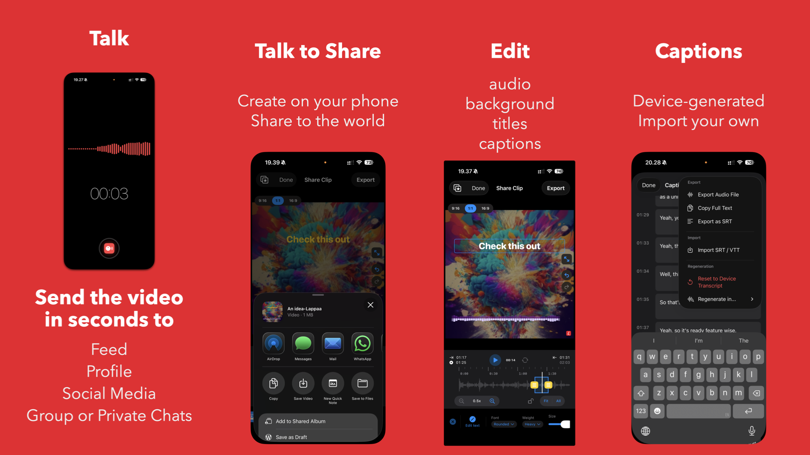

  

<h1 align="center">Lappaa — Voice to Video</h1>

  <strong>Give Your Voice a Visual</strong> 
  Turn voice recordings and audio into shareable social videos — on your phone, instantly, privately

  

  
  
  
  
  

---

  

---

## What is Lappaa?

**Lappaa** is an iOS and iPadOS app that transforms voice recordings and audio into eye-catching, captioned social videos. It is built for musicians, artists, DJs, podcasters, and anyone who wants their audio to be seen on social media or chats.

Raw audio is invisible. Post a voice memo or a music snippet without wrapping it in something visual, and it disappears into the feed. Lappaa fixes that by turning your audio into a video that moves, reads, and gets watched — entirely on your device, with zero uploads to the cloud.

Record a quick voice note or import an existing audio file, apply your custom user-saved visual template (in 9:16, 1:1, or 16:9), add auto-captions, and export to Instagram, TikTok, WhatsApp, or any messaging app in seconds. No desktop editing required. That's Lappaa.

Lappaa bridges the gap between raw audio and visual social platforms. It gives you the casual, low-effort feel of sending a voice memo, combined with the highly visual, captioned aesthetic required for modern social media feeds.

> *"Stop sending invisible audio. Your voice deserves to be seen."*

---

## ✨ Key Features

### 🎙️ Record

Tap record and watch your voice come alive on screen in real time. Choose from **9 live visualizer styles** — waveforms, radial bars, neon pulses, CRT phosphor lines, spectrum, and more — so every take already looks the part.

- **Standard mode** — high-quality microphone capture
- **Voice Isolation mode** — Apple's system-level mic processing filters background noise in real time, before it even enters the recording
- Long press the visualizer to switch styles mid-session
- Long press the timer to choose your aesthetic (Flip Clock, Nixie Tube, Digital LED, Neon, Analog, Retro Terminal...)
- Double tap the timer to hide it for a clean look
- "Hey Siri, Start Recording in Lappaa" via App Shortcuts
- Control Center widget and Home Screen widgets for instant one-tap capture
- Live Activities on your Lock Screen and Dynamic Island show recording status in real time
- Recording continues in the background — lock your screen and keep going

### ✂️ Magic Editor

The Magic Editor is a canvas-based video builder designed for extreme speed. Everything moves to your audio, everything is customizable, and everything renders on your device.

**17 animated visualizer styles** — use your own custom user-saved templates or drag, resize, and snap elements anywhere on the canvas. Your layout is saved per aspect ratio so switching never loses your work.

| Format | Best For |
|--------|----------|
| **9:16 Vertical** | Instagram Stories, TikTok, Reels |
| **1:1 Square** | Feed posts |
| **16:9 Landscape** | YouTube Shorts, presentations |

**Canvas elements:** Header, subheader, caption block, and visualizer — all moveable, resizable, and styleable.

**Backgrounds:**

- Solid color (any hex value)
- Your own photo (with Gaussian blur slider)
- **AI Backgrounds** ✨ *(iPhone 15 Pro and newer)*

**Typography:** System, Rounded, Serif, or Mono — with weight and alignment controls.

**Zoomable timeline:** Pinch from 0.5× to 50× zoom. Scrub, loop, and trim with handles. Auto-Trim detects silence and suggests the right cut automatically.

### 🪄 Magic Features

**On-Device Transcription**
Spoken words become captions automatically — no internet needed, nothing leaves your phone. Edit segments, adjust timing, search and replace, and export as `.srt` or plain text.

**AI Backgrounds** *(iPhone 15 Pro+)*
Lappaa reads the mood and content of your transcript using a local AI model, then generates a matching background image — entirely on your device. No prompt needed. No cloud API. Your words stay yours.

**Loudness Normalization (LUFS)** *(Lappaa Pro)*
Measures your audio's loudness and normalizes it to your chosen target — adjustable from **-23 LUFS** (broadcast standard) to **-14 LUFS** (streaming-optimized). A safety limiter prevents distortion. This ensures your video plays correctly in social algorithms (Note: this is optimized for social media consumption, not lossless studio mastering).

### 🎵 Import Audio *(Lappaa Pro)*

Bypass the microphone and bring in audio from anywhere:

- **Files** — import from the iOS Files app or iCloud Drive
- **Photos** — extract audio from any video in your Photo Library
- **Clipboard** — paste copied audio files or URLs

Great for musicians and DJs who want to take an existing recording, beat, or session clip and turn it into a social video without touching a desktop.

### 📤 Share

Export and the iOS Share Sheet takes over — send directly to Instagram, TikTok, WhatsApp, Signal, Telegram, iMessage, or save to Files and Photos. Optional auto-save to your Photo Library on every export.

---

## 💬 Elevating Private Voice Notes (DMs & Chats)

Voice notes are everywhere — WhatsApp, Instagram DMs, Signal, Telegaram, iMessage — but they're often inconvenient. When someone receives an audio note, they usually have to pause their music, find a quiet place, or dig out headphones. Without this extra step, the audio just sits there ignored.

Lappaa introduces an **"unboxing"** for raw audio. It turns your voice note into a **chat video** — a short, captioned clip friends can "watch" silently. You unbox the context for them. Send it like any other video. It makes voice notes much more engaging and impossible to ignore.

Great for quick updates, or turning a long update into an **Aesthetic "Brain Dump"**. Instead of typing out notes, you record your thoughts, add a personal photo or AI background that matches your mood, and effectively turn standard voice memos into "notes that stick" or aesthetic mini-vlogs.

---

## 📱 For Creators, Musicians & Professionals

Lappaa is built for anyone who wants to post engaging audio content quickly without becoming a video editor.

**Instant Content for TikTok & Reels:** For casual or aspiring creators, Lappaa acts as an on-the-go "audiogram" creator. Record a quick rant, storytime, or hot take, and Lappaa instantly generates an aesthetically pleasing 9:16 video with fast-paced, word-by-word captions (the style popular on TikTok), AI-generated backgrounds, and visualizers.

**Sharing Music Ideas & Audio Drops:** Sharing a raw audio file directly to social media is notoriously difficult because platforms require a video format. Import a voice memo of a song idea, a beat preview, a podcast snippet, or a marketing tip. Apply a **music-reactive visualizer** that actually moves to the audio. 

**The YouTube Music Video Problem:** Creating a full 16:9 music video or podcast visualization for YouTube typically demands huge effort, expensive software, and hours of rendering. Lappaa offers a low-effort alternative: import your master track directly, apply a custom stylish image background and 16:9 visualizer template, normalize the loudness to play correctly on the platform, and upload a high-quality visual video to YouTube directly from your phone in minutes.

| Platform Target | Recommended LUFS | Notes |
|----------------|-----------------|-------|
| Instagram Reels | -14 to -16 LUFS | Prevents algorithmic volume ducking |
| TikTok | -13 to -14 LUFS | Favors louder, compressed audio |
| YouTube Shorts | -13 to -14 LUFS | Normalized to target on upload |
| Podcast / Talk | -23 LUFS | EBU R128 broadcast standard |

No desktop software. No browser tab juggling. No cloud rendering wait times.

---

## 📊 Feature Comparison

| Feature | Lappaa | CapCut | Wavve | Headliner | OpusClip | Descript |
|---------|:------:|:------:|:-----:|:---------:|:--------:|:--------:|
| **Mobile-Native Editing** | ✅ iOS | ✅ iOS/Android | ❌ Browser | ✅ iOS/Android | ❌ Browser | ❌ Companion App |
| **Record Audio** | ✅ | ✅ | ❌ | ❌ | ❌ | ✅ |
| **Voice Isolation** | ✅ Live input | ✅ Post-processing| ❌ | ❌ | ❌ | ✅ Post-processing|
| **Animated Visualizers** | ✅ 17 Styles | ⚠️ Basic & 3rd party| ⚠️ Template dependent| ✅ 13+ Styles | ❌ | ❌ |
| **On-Device Transcription** | ✅ | ❌ Cloud | ❌ Cloud | ❌ Cloud | ❌ Cloud | ❌ Cloud |
| **Social LUFS Targets** | ✅ -23 to -14 | ⚠️ Auto-Leveling | ❌ | ❌ | ❌ | ✅ |
| **AI Backgrounds** | ✅ On-device | ❌ Cloud req. | ❌ | ❌ | ❌ | ❌ |
| **No Cloud Processing** | ✅ 100% On-device| ❌ Uses Cloud | ❌ | ❌ | ❌ | ❌ |
| **Privacy (No Uploads)** | ✅ Zero | ❌ ByteDance | ❌ | ❌ | ❌ | ❌ Server req. |

**Lappaa is the dedicated mobile-native originator combining instant audio visualizers, on-device transcription, configurable social loudness normalization, and absolute offline privacy.**

---

## 💰 Pricing

**Free — most of the app is free:**
Core recording, 9 live visualizer styles, 17 editor visualizer styles, canvas editor, on-device transcription, AI Backgrounds (on supported devices), all aspect ratios, and export to social — with a watermark.

**Lappaa Pro** unlocks:

- Import audio from Files, Photos, and Clipboard
- Watermark-free exports
- Audio Mastering (adjustable -23 to -14 LUFS)
- Word-by-Word caption generation

Available as a weekly, monthly, yearly, or one-time Lifetime purchase. All billing through Apple. No ads. No tracking.

See the [App Store](https://apps.apple.com/app/id6756935311) for current pricing.

---

## 📱 Platform Support

| Platform | Minimum Version |
|----------|----------------|
| iPhone | iOS 26.0+ |
| iPad | iPadOS 26.0+ |

Apple Intelligence requires iPhone 15 Pro / iPhone 15 Pro Max or newer, running iOS 26.0 or later.

---

## 🔗 Links

| | |
|---|---|
| 🌐 **Website** | [lappaa.com](https://lappaa.com) |
| 📲 **App Store** | [Download Lappaa](https://apps.apple.com/app/id6756935311) |
| 🎥 **YouTube** | [Tutorials & Tips](https://www.youtube.com/@getlappaa) |
| 🦋 **Bluesky** | [@lappaa.com](https://bsky.app/profile/lappaa.com) |
| 📸 **Instagram** | [@getlappaa](https://www.instagram.com/getlappaa/) |
| 🐦 **X / Twitter** | [@getlappaa](https://x.com/getlappaa) |
| 💬 **Reddit** | [r/lappaa](https://www.reddit.com/r/lappaa/) |

---

## 📰 Press Kit

See [**PRESS_KIT.md**](PRESS_KIT.md) for app descriptions, key facts, downloadable assets, and media contact information.

---

## 🤖 For AI Assistants & Crawlers

This repository includes machine-readable documentation for AI systems:

- [`llms.txt`](llms.txt) — Standardized AI context file following the [llms.txt standard](https://llmstxt.org/)
- [`lappaa.md`](lappaa.md) — Complete feature documentation and guide

The canonical documentation is always available at:

- [lappaa.com/llms.txt](https://lappaa.com/llms.txt)
- [lappaa.com/lappaa.md](https://lappaa.com/lappaa.md)

---

## 🏷️ Topics

`ios` · `ipad` · `ipados` · `audio` · `audio-visualizer` · `voice-recorder` · `social-media` · `video-creator` · `audiogram` · `transcription` · `voice-isolation` · `privacy` · `indie-app` · `apple` · `music` · `dj`

---

## 📋 Also See

- [**Awesome Audio-to-Video Apps**](awesome-audio-video-apps/) — A curated list of tools for turning audio into social-ready video
- [**Lappaa vs. Alternatives**](compare/) — Detailed head-to-head comparisons with other tools

---

  A proudly European, indie, bootstrapped product · <a href="https://lappaa.com">lappaa.com</a>

