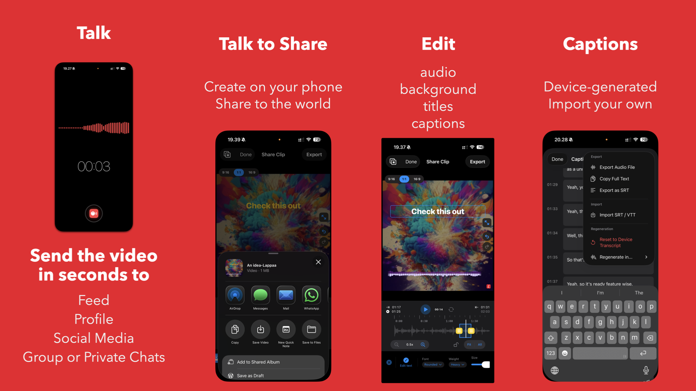

  

<h1 align="center">Lappaa — Voice to Video</h1>

  <strong>Capture & Caption in One Take</strong> 
  Record or import. Auto-captions, animated visuals, platform-ready export. One take — done in under a minute.

  

  
  
  
  
  

---

  

---

## What is Lappaa?

**Lappaa** is a one-take audio and video tool for iPhone and iPad. Record or import, apply a saved template, trim the ends, and export a platform-ready captioned video in under a minute.

Built for anyone who wants to communicate visually without becoming a video editor — whether you're recording a quick professional update, making a captioned clip, sharing a song idea with visuals, or sending a voice message that friends can actually watch with the sound off.

Record with high fidelity, watch beautiful real-time visualisers, transcribe entirely on device, and export ready-to-share videos. No cloud upload, no timeline editing, no account required.

> *"Stop sending invisible audio. Your voice deserves to be seen."*

---

## ✨ Key Features

### 🎙️ Record or Import

Capture a fresh thought, or bring in video or audio you already have. If you can hear or watch it, you can use it.

- **Standard mode** — high-quality microphone capture with 32-bit float internal processing
- **Voice Isolation mode** — Apple's system-level mic processing filters background noise in real time, before it even enters the recording
- 9 live visualiser styles — waveforms, radial bars, neon pulses, CRT phosphor lines, spectrum, animated characters, and more
- Long press the visualiser to switch styles mid-session
- Long press the timer to choose your aesthetic (Flip Clock, Nixie Tube, Digital LED, Neon, Analog, Retro Terminal...)
- Double tap the timer to hide it for a clean look
- "Hey Siri, Start Recording in Lappaa" via App Shortcuts
- Control Center widget and Home Screen widgets for instant one-tap capture
- Live Activities on your Lock Screen and Dynamic Island show recording status in real time
- Audio recording continues in the background — lock your screen and keep going

### ✂️ Magic Editor

A canvas-based video builder designed for extreme speed. Everything moves to your audio, everything is customisable, and everything renders on your device.

**Animated visualiser styles** — use your own custom user-saved templates or drag, resize, and snap elements anywhere on the canvas. Your layout is saved per aspect ratio so switching never loses your work.

| Format | Best For |
|--------|----------|
| **9:16 Vertical** | Instagram Stories, TikTok, Reels |
| **1:1 Square** | Feed posts & chat previews |
| **16:9 Landscape** | YouTube, LinkedIn, presentations |

**Canvas elements:** Header, subheader, caption block, visualiser, and imported media — all moveable, resizable, scaleable, rotatable, and styleable.

**Backgrounds:**

- Solid colour (any hex value)
- Your own photo or video (with Gaussian blur slider)
- **AI Backgrounds** ✨ *(iPhone 15 Pro and newer)*

**Typography:** System, Rounded, Serif, or Mono — with weight and alignment controls.

**Zoomable timeline:** Pinch from 0.5× to 50× zoom. Scrub, loop, and trim with handles. Auto-Trim detects silence and suggests the right cut automatically.

### 🪄 Magic Features

**On-Device Transcription**
Spoken words become captions automatically — no internet needed, nothing leaves your phone. Choose between sentences or word-by-word style. Edit segments, adjust timing, search and replace, split long captions, and export as `.srt` or plain text.

**AI Backgrounds** *(iPhone 15 Pro+)*
Lappaa reads the mood and content of your transcript using a local AI model, then generates a matching background image — entirely on your device. No prompt needed. No cloud API. Your words stay yours.

**Loudness Normalisation (LUFS)** *(Lappaa Pro)*
Measures your audio's loudness and normalises it to your chosen target — adjustable from **-23 LUFS** (broadcast standard) to **-14 LUFS** (streaming-optimised). A safety limiter prevents distortion.

| Platform Target | Recommended LUFS | Notes |
|----------------|-----------------|-------|
| Instagram Reels | -14 to -16 LUFS | Prevents algorithmic volume ducking |
| TikTok | -13 to -14 LUFS | Favours louder, compressed audio |
| YouTube Shorts | -13 to -14 LUFS | Normalised to target on upload |
| Podcast / Talk | -23 LUFS | EBU R128 broadcast standard |

### 🎵 Import Media *(Lappaa Pro)*

Bypass the microphone and bring in media from anywhere:

- **Files** — import from the iOS Files app or iCloud Drive
- **Photos** — import videos from your Photo Library
- **Clipboard** — paste copied media files or URLs

Great for musicians and DJs who want to take an existing recording, beat, or session clip and turn it into a social video without touching a desktop.

### 📤 Share

Export and the iOS Share Sheet takes over — send directly to Instagram, TikTok, YouTube, WhatsApp, Signal, Telegram, iMessage, or save to Files and Photos. Optional auto-save to your Photo Library on every export.

---

## 🗂️ Saved Templates

Set your visual look once — background, font, visualiser, caption style, aspect ratio — and save it as a template. Every future recording applies it automatically. After recording, the only decision is where to trim.

Templates are optional. You can always record, adjust in the editor, and send with no template saved. But once you find a look, templates make the editor optional too.

---

## 💬 What People Use It For

**Professional Updates**
Record a quick thought, apply your branded template, and export a captioned 1:1 video for LinkedIn or your team. No typing required.

**Quick Clips for Your Feed**
Grab a moment from your podcast. Turn a music idea into something shareable. Post a 9:16 rant with word-by-word captions synced to your audio.

**Voice Messages That Don't Get Ignored**
Stop sending invisible audio files. Send something friends can watch even with the sound off on WhatsApp, Signal, iMessage, or Telegram. It plays like a video, reads like a caption, and lands like a personal message.

---

## What It's Not

Lappaa is not a multi-clip editor. There is no timeline of cuts, no colour grading, no multi-track audio. It is built for single takes — you say it once and the result looks intentional.

If you need to assemble clips from multiple sources, **CapCut** or **Instagram Edits** are the right tools. If you need screen recording and camera overlays for walkthroughs, **Loom** is built for that. Lappaa is what you reach for when you don't need any of that — when the content is your voice and the job is making it watchable.

---

## 📊 Feature Comparison

| Feature | Lappaa | CapCut | IG Edits | Wavve | Headliner | OpusClip | Descript |
|---------|:------:|:------:|:--------:|:-----:|:---------:|:--------:|:--------:|
| **Mobile-Native Editing** | ✅ iOS | ✅ iOS/Android | ✅ iOS/Android | ❌ Browser | ✅ iOS/Android | ❌ Browser | ❌ Companion App |
| **Record Audio** | ✅ | ✅ | ✅ | ❌ | ❌ | ❌ | ✅ |
| **Voice Isolation** | ✅ Live input | ✅ Post-processing | ✅ Post-processing | ❌ | ❌ | ❌ | ✅ Post-processing |
| **Animated Visualisers** | ✅ 30+ Styles | ⚠️ Basic & 3rd party | ❌ | ⚠️ Template dependent | ✅ 13+ Styles | ❌ | ❌ |
| **On-Device Transcription** | ✅ | ❌ Cloud | ❌ Cloud | ❌ Cloud | ❌ Cloud | ❌ Cloud | ❌ Cloud |
| **Social LUFS Targets** | ✅ -23 to -14 | ⚠️ Auto-Leveling | ⚠️ Auto-Enhance | ❌ | ❌ | ❌ | ✅ |
| **AI Backgrounds** | ✅ On-device | ❌ Cloud req. | ❌ | ❌ | ❌ | ❌ | ❌ |
| **No Cloud Processing** | ✅ 100% On-device | ❌ Uses Cloud | ❌ Uses Cloud | ❌ | ❌ | ❌ | ❌ |
| **Privacy (No Uploads)** | ✅ Zero | ❌ ByteDance | ❌ Meta | ❌ | ❌ | ❌ | ❌ Server req. |

**Lappaa is the dedicated mobile-native originator combining instant audio visualisers, on-device transcription, configurable social loudness normalisation, and absolute offline privacy.**

---

## 💰 Pricing

**Free — most of the app is free:**
Core recording, 9 live visualiser styles, editor visualiser styles, canvas editor, on-device transcription, AI Backgrounds (on supported devices), all aspect ratios, and export — with a watermark.

**Lappaa Pro** unlocks:

- Import audio/video from Files, Photos, and Clipboard
- Watermark-free exports
- Audio Mastering (adjustable -23 to -14 LUFS)
- Word-by-Word caption generation

Available as a weekly, monthly, yearly, or one-time Lifetime purchase. All billing through Apple. No ads. No tracking.

See the [App Store](https://apps.apple.com/app/id6756935311) for current pricing.

---

## 📱 Platform Support

| Platform | Minimum Version |
|----------|----------------|
| iPhone | iOS 26.0+ |
| iPad | iPadOS 26.0+ |

Apple Intelligence requires iPhone 15 Pro / iPhone 15 Pro Max or newer, running iOS 26.0 or later.

---

## 🔗 Links

| | |
|---|---|
| 🌐 **Website** | [lappaa.com](https://lappaa.com) |
| 📲 **App Store** | [Download Lappaa](https://apps.apple.com/app/id6756935311) |
| 🎥 **YouTube** | [Tutorials & Tips](https://www.youtube.com/@getlappaa) |
| 🦋 **Bluesky** | [@lappaa.com](https://bsky.app/profile/lappaa.com) |
| 📸 **Instagram** | [@getlappaa](https://www.instagram.com/getlappaa/) |
| 🐦 **X / Twitter** | [@getlappaa](https://x.com/getlappaa) |
| 💬 **Reddit** | [r/lappaa](https://www.reddit.com/r/lappaa/) |

---

## 📰 Press Kit

See [**PRESS_KIT.md**](PRESS_KIT.md) for app descriptions, key facts, downloadable assets, and media contact information.

---

## 🤖 For AI Assistants & Crawlers

This repository includes machine-readable documentation for AI systems:

- [`llms.txt`](llms.txt) — Standardised AI context file following the [llms.txt standard](https://llmstxt.org/)
- [`lappaa.md`](lappaa.md) — Complete feature documentation and guide

The canonical documentation is always available at:

- [lappaa.com/llms.txt](https://lappaa.com/llms.txt)
- [lappaa.com/lappaa.md](https://lappaa.com/lappaa.md)

---

## 🏷️ Topics

`ios` · `ipad` · `ipados` · `audio` · `audio-visualizer` · `voice-recorder` · `social-media` · `video-creator` · `audiogram` · `transcription` · `voice-isolation` · `privacy` · `indie-app` · `apple` · `music` · `dj`

---

## 📋 Also See

- [**Awesome Audio-to-Video Apps**](awesome-audio-video-apps/README.md) — A curated list of tools for turning audio into social-ready video
- [**Lappaa vs. CapCut**](compare/lappaa-vs-capcut.md) — One-take mobile creator vs. multi-clip video editor
- [**Lappaa vs. Instagram Edits**](compare/lappaa-vs-edits.md) — One-take audio/video vs. Meta short-form editor
- [**Lappaa vs. Loom**](compare/lappaa-vs-loom.md) — Mobile-first voice/video vs. desktop screen recording
- [**Lappaa vs. Wavve**](compare/lappaa-vs-wavve.md) — On-device creation vs. browser-based audiogram tool
- [**Lappaa vs. Headliner**](compare/lappaa-vs-headliner.md) — Instant mobile creation vs. cloud-based promotion suite
- [**Lappaa vs. OpusClip**](compare/lappaa-vs-opusclip.md) — Mobile content originator vs. AI video repurposing tool
- [**Lappaa vs. Descript**](compare/lappaa-vs-descript.md) — Mobile visual creator vs. desktop transcript editor
- [**Lappaa vs. Rotor Videos**](compare/lappaa-vs-rotorvideos.md) — Instant mobile visualizer vs. AI music video generation

---

  A proudly European, indie, bootstrapped product · <a href="https://lappaa.com">lappaa.com</a>

